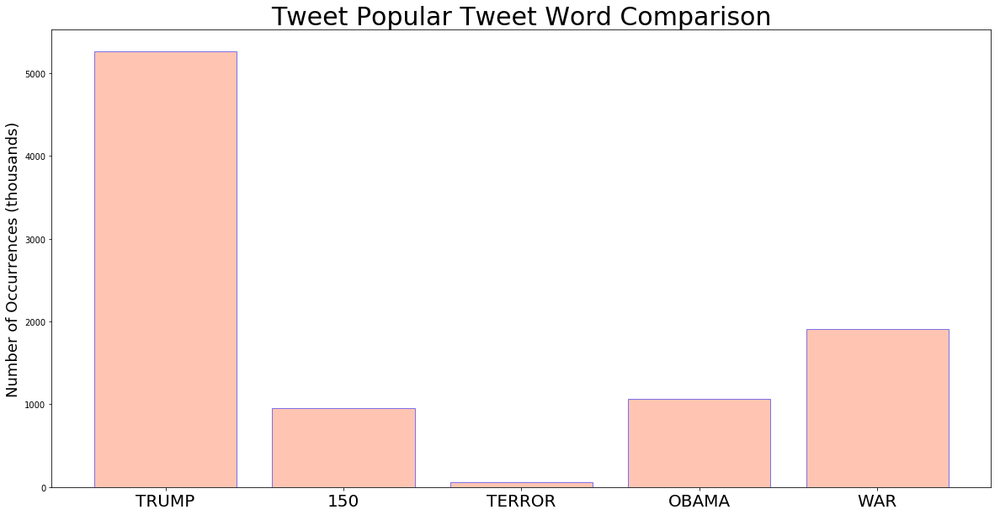
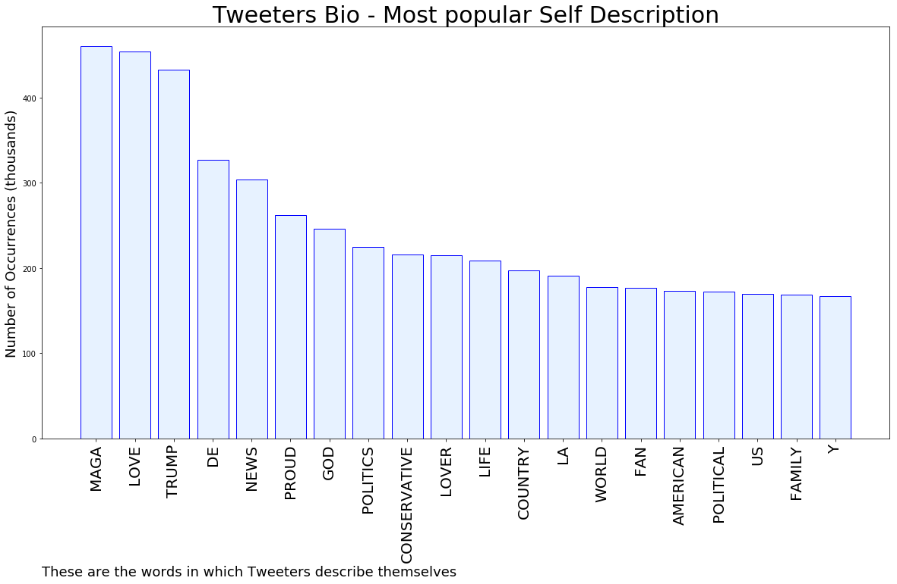
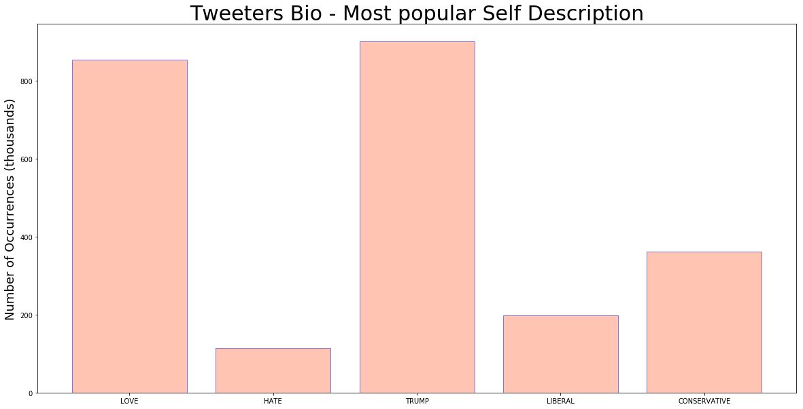

# MURCHIE85 TWITTER PROCESSING 

&#x1F34E; **TOPIC = "Iran"**


## AUTOMATED RESEARCH SUMMARY


<br></br>

<div class="alert alert-block alert-danger"><b> This repo is for pulling metrics on a given keyword or hashtag and performs a series of reporting and analysis.</b></div>


|                **Sample-Tweets**        |
| :-------------: |
| <div class="alert alert-block alert-warning">RT @realDonaldTrump: President Obama made a desperate and terrible deal with Iran - Gave them 150 Billion Dollars plus I.8 Billion Dollars…</div> <div class="alert alert-block alert-success">Trump halted military response to Iran because it was ‘not proportionate’: https://t.co/dJ19CVkNqm</div> <div class="alert alert-block alert-info">If the NYT report of the imminent strike on #Iran and its last minute cancellation is true, then NSA Bolton was mee… https://t.co/zvlRfLyBMO</div> |

The most popular user is: **MeanMachine60**

<div class="alert alert-block alert-danger"> RT @realDonaldTrump: Iran made a very big mistake!</div>


## GOOGLE SEARCH DEMOGRAPHICS 

Google Search interest           | Countries
:-------------------------:|:-------------------------:
  |  
<br>

## RELATED TOPICS  & QUERIES 

topics          | searches
:-------------------------:|:-------------------------:
  |  

<br>
<br>


## RELATED METRICS
<br>

| Metric | Value |
| ------------- | ------------- |
| #1 Most tweeted to  | **realDonaldTrump** |
| #2 Most tweeted to  | **tedlieu** |
| #3 Most tweeted to  | **GeorgeTakei** |
| NewProfiles (less than 10 days) | 0.73%  |
| Tweeters with < 10 followers  | 4.06%|
| Tweeters with > 1000000 followers  | 0.24%  |


<br>

## MOST POPULAR TWEET TERMS 
<br>

| Popularity Rank  | Term |
| ------------- | ------------- |
| first  | **TRUMP**  |
| second  | **US**  |
| third  | **WAR** |
| fourth  | **PRESIDENT**  |
| fifth  | **@REALDONALDTRUMP:**  |


<br>


## Twitter Bio Analysis


### SENTIMENT ANALYSIS


VIEWS WERE : **SUBJECTIVE**  (23.08%) & **NEGATIVELY-SUBJECTIVE** (23.08%) **OBJECTIVE** (53.85%)

### TWEET SAMPLE 

Random value picked from array: 

<div class="alert alert-block alert-info">Trump halted military response to Iran because it was ‘not proportionate’: https://t.co/dJ19CVkNqm</div>

### MOST RETWEETED

The most retweeted user is: **MeanMachine60**

<div class="alert alert-block alert-danger"> RT @realDonaldTrump: Iran made a very big mistake!</div>

### CONCLUSION & EXTERNAL ANALYSIS

*This is my [Adam McMurchie`s] opinion on the data from the tweets, it serves as no objective truth.Since the tweets themselves are a mixture of fact & opinion.
<br>

Authors analytical summary on request.

**RECOMMENDATIONS** WILL BE UPDATED IN NEXT  24 HOURS 
<br>

# TECHNICAL WALKTHROUGH 
[GENERATOR](#GENERATOR)

<a id='HEAD'>''</a>

## OVERVIEW

**SKIP TO BOTTOM FOR FULL RESULTS & GRAPH BREAKDOWN **

- Pulls live tweets from all over twitter 
- Imports Tweepy Library 
- Consumes Twitter API 
- Desgined to be keyword driven
- All metrics can be captured
- No limit on Runtime (best to terminate when you want)

## Limitations & info
1. LOCATION filter is tricky
2. Streaming connects to the “public streams” (all public data) 
3. This is data provided by the Twitter API which accesses their database, the maintenence of DB and thus data quality is managed by Twitter

Example of parameter setting done in stream filter 

```
stream.filter(follow=["2211149702"])
```


### AUTHOR : ADAM MCMURCHIE 


Github [here](https://github.com/murchie85)  

Mysite [here](https://murchie85.github.io/)

# AUTHENTICATION

You will need to change f variable to point to your credentials file, I save mines in a text file and split the comma. Not uploaded to this repo obviously.


```python
import datetime
import os
from ipywidgets import IntProgress
from IPython.display import display
from IPython.display import clear_output
import time
import sys
# Import the necessary package to process data in JSON format
try:
    import json
except ImportError:
    import simplejson as json

# Import the tweepy library
import tweepy


f = open("../donotgit/access.txt", "r")
keys = f.read()
f.close()
keys  = keys.split(',')
#print("Access Keys are : " + str(keys))
ACCESS_TOKEN = keys[0]
ACCESS_SECRET = keys[1]


f = open("../donotgit/consumer.txt", "r")
keys = f.read()
keys  = keys.split(',')
#print("Consumer Keys are : " + str(keys))
CONSUMER_KEY = keys[0]
CONSUMER_SECRET = keys[1]


# Variables that contains the user credentials to access Twitter API 
# Captured earlier 

# Setup tweepy to authenticate with Twitter credentials:

auth = tweepy.OAuthHandler(CONSUMER_KEY, CONSUMER_SECRET)
auth.set_access_token(ACCESS_TOKEN, ACCESS_SECRET)

# Create the api to connect to twitter with your creadentials
api = tweepy.API(auth, wait_on_rate_limit=True, wait_on_rate_limit_notify=True, compression=True)


```

# TOPIC, SCANTYPE & PARAMETERS SELECTION
<a id='PARAMS'></a>

1. Select which topic you wish to scan for (You can use # or most special characters). 
2. Scantype means you can chose between pulling in tweets as they happen or pull down historical tweets so you can view things like number of retweets (as if it is realtime, there wont have been time for retweet)

[JUMP TO TWEET SECTION](#TWEET)  
[JUMP TO BIO](#BIO)


```python
TOPIC = 'Iran'

# Realtime = 1 Historical = 2
scantype = 2
image = ''

# UPDATE THE TWEET TERMS YOU ARE INTERESTED IN 
TWEET_WORDONE='TRUMP'
TWEET_WORDTWO='150'
TWEET_WORDTHREE='terror'
TWEET_WORDFOUR = 'obama'
TWEET_WORDFIVE = 'war'
TWEET_WORDSIX = 'SAMPLE'
TWEET_WORDSEVEN = 'SAMPLE'
TWEET_WORDEIGHT = 'SAMPLE'
TWEET_WORDNINE = 'SAMPLE'
TWEET_WORDTEN = 'SAMPLE'


# EXCLUDE WORDS FROM ANALYSIS
tweet_delete_a = TOPIC.upper()
tweet_delete_b = 'SAMPLE'
tweet_delete_c = "SAMPLE"
tweet_delete_d = 'SAMPLE'
tweet_delete_e = 'SAMPLE'


# UPDATE WITH WORDS YOU WANT TO INTERROGATE

BIO_WORDONE='love'
BIO_WORDTWO='hate'
BIO_WORDTHREE='trump'
BIO_WORDFOUR = 'liberal'
BIO_WORDFIVE = 'conservative'
BIO_WORDSIX = 'SAMPLE'
BIO_WORDSEVEN = 'SAMPLE'
BIO_WORDEIGHT = 'SAMPLE'
BIO_WORDNINE = 'SAMPLE'
BIO_WORDTEN = 'SAMPLE'


# SCAN A TWEET FOR A GIVEN BIO¶
CHOSEN_BIO_WORD = 'proud'
# SCAN BIO FOR GIVEN TWEET
CHOSEN_TWEET_WORD = 'hate'

# LINK BIO AND TWEET
CHOSEN_TWEET_WORD_ONE = 'hate'
BIO_CHOSEN_WORD_ONE = 'love'

```

# REALTIME TWEETS

This is where the magic happens, api authentication is set up, tweepy library is imported for the work and a class allow us to pull live data. This is appended to array for processing later. 


*NOTE* -   this will just keep running until you force terminate, i haven't added in a terminate loop yet.


```python
if scantype != 1:
    raise

status_array = []

progress = 0
max_count = 10000

f = IntProgress(description='Processing:',min=0, max=max_count,) # instantiate the bar
display(f) # display the bar


class StreamListener(tweepy.StreamListener):
    tweet_number=0   # class variable
    


    def on_status(self, status):
        self.max_tweets=max_count # max number of tweets
        self.tweet_number+=1   
        f.value += 1 # signal to increment the progress bar
        progress = (f.value/max_count) * 100
        progress = format(progress, '.2f')
        print('Progress: ' + str(progress) + " %")
        clear_output(wait=True)
        status_array.append(status._json)

        if self.tweet_number>=self.max_tweets:
            sys.exit('PROCESSING COMPLETE : '+str(self.max_tweets)+' tweets processed.')

        
    def on_error(self, status_code):
        if status_code == 420:
            return False

stream_listener = StreamListener()
stream = tweepy.Stream(auth=api.auth, listener=stream_listener)

#print('Pulling down data.....')
stream.filter(track=[TOPIC],languages=["en"])


```


    ---------------------------------------------------------------------------

    RuntimeError                              Traceback (most recent call last)

    <ipython-input-8-a1e8c97c4066> in <module>
          1 if scantype != 1:
    ----> 2     raise
          3 
          4 status_array = []
          5 


    RuntimeError: No active exception to reraise


# HISTORICAL TWEETS


```python
# HISTORICAL DATA SWITCHED OFF (IF YOU SWITCH ON, THEN SWITCH STREAM OFF ABOVE)

if scantype != 2:
    raise


status_array = []
LOOP_COUNT = 0
max_count = 10000


# ------ENTER YOUR SERACH TERM HER E--------
tweets = tweepy.Cursor(api.search, q=TOPIC, count=int(max_count))

# TRACK PROGRESS
f = IntProgress(min=0, max=max_count) # instantiate the bar
display(f) # display the bar
progress = 0

print('Pulling down data.....')                    
for tweet in tweets.items(int(max_count)):
    f.value+=1 # signal to increment the progress bar
    progress = (f.value/max_count) * 100
    progress = format(progress, '.2f')
    print('Progress: ' + str(progress) + " %")
    clear_output(wait=True)
    time.sleep(.1)
    status_array.append(tweet._json)


print('Processing complete')


```

    Processing complete


# QUICK PEEK


```python
print('Number of records')
print(len(status_array))
print('')
print('The data keys are : ')
print(status_array[0].keys())
print('')
#print('An example element looks like: ')
#print(status_array[0])
```

    Number of records
    10000
    
    The data keys are : 
    dict_keys(['created_at', 'id', 'id_str', 'text', 'truncated', 'entities', 'metadata', 'source', 'in_reply_to_status_id', 'in_reply_to_status_id_str', 'in_reply_to_user_id', 'in_reply_to_user_id_str', 'in_reply_to_screen_name', 'user', 'geo', 'coordinates', 'place', 'contributors', 'retweeted_status', 'is_quote_status', 'retweet_count', 'favorite_count', 'favorited', 'retweeted', 'lang'])
    


# REPORT GENERATION

**REMOVE** quotes to switch on reporting, you may need to create the folders listed below i.e. data folder description folder etc.


```python
# REMOVE QUOTES TO ACTIVATE 
# append to filename
"""
currentDT = datetime.datetime.now()
filename = "data/streamout-" + str(currentDT) + ".txt"

print(filename)

with open(filename, 'w') as f:
    for item in status_array:
        f.write("%s\n" % item)
f.close()


# WRITE OUT FULL REPORT
reportfile = "reports/printout-"+ str(currentDT) + ".txt"
descriptionfile = "data/description/printout-"+ str(currentDT) + ".txt"
tweetfile = "data/tweet/printout-"+ str(currentDT) + ".txt"

REPORTCOUNT = 0
with open(reportfile, 'w') as f:
    for y in range(0, len(status_array)):
        REPORTCOUNT = REPORTCOUNT + 1
        f.write('************************************************************\n')
        f.write(status_array[y]['text'])
        f.write('------------------------------\n')
        f.write(status_array[y]['created_at'])
        f.write('------------------------------\n')
        f.write(status_array[y]['user']['name'])
        f.write('------------------------------\n')
        f.write(str(status_array[y]['user']['location']))
        f.write('------------------------------\n')
        f.write(str(status_array[y]['user']['description']))
        f.write('--------------REPLY COUNT----------------\n|')
        f.write(str(status_array[y]['reply_count']))
        f.write('--------------RETWEET COUNT----------------\n')
        f.write(str(status_array[y]['retweet_count']))
        f.write('--------------RETWEETED?----------------\n')
        f.write(str(status_array[y]['retweeted']))
        f.write('--------------RETWEET COUNT----------------\n')
        f.write(str(status_array[y]['retweet_count']))
        f.write('--------------FAVOURITED----------------\n')
        f.write(str(status_array[y]['favorited']))
        f.write('--------------FAVOURITE COUNT----------------\n')
        f.write(str(status_array[y]['favorite_count']))
        f.write('\n')
        f.write('\n')
    f.write('number of records are : ')
    f.write(str(REPORTCOUNT))
        
f.close()
    
    
# WRITE OUT ONLY DESCRIPTION
    
REPORTCOUNT = 0
with open(descriptionfile, 'w') as f:
    for y in range(0, len(status_array)):
        REPORTCOUNT = REPORTCOUNT + 1
        f.write('************************************************************\n')
        f.write(str(status_array[y]['user']['description']))
        f.write('\n')
    f.write('number of records are : ')
    f.write(str(REPORTCOUNT))
        
f.close()
    

# WRITE OUT ONLY TWEET
    
REPORTCOUNT = 0
with open(tweetfile, 'w') as f:
    for y in range(0, len(status_array)):
        REPORTCOUNT = REPORTCOUNT + 1
        f.write('************************************************************\n')
        f.write(status_array[y]['text'])
        f.write('\n')
    f.write('number of records are : ')
    f.write(str(REPORTCOUNT))
        
f.close()

    
    
    
    
    
print('=========================SAMPLE OUTPUT================================')
print('************************************************************')
print(status_array[0]['text'])
print('------------------------------')
print(status_array[0]['created_at'])
print('------------------------------')
print(status_array[0]['user']['name'])
print('------------------------------')
print(status_array[0]['user']['location'])
print('------------------------------')
print(status_array[0]['user']['description'])
print('--------------REPLY COUNT----------------')
print(status_array[0]['reply_count'])
print('--------------RETWEET COUNT----------------')
print(status_array[0]['retweet_count'])
print('--------------RETWEETED?----------------') 
print(status_array[0]['retweeted'])
print('--------------RETWEET COUNT----------------')
print(status_array[0]['retweet_count'])
print('--------------FAVOURITED----------------')
print(status_array[0]['favorited'])
print('--------------FAVOURITE COUNT----------------')
print(status_array[0]['favorite_count'])
"""

```


    '\ncurrentDT = datetime.datetime.now()\nfilename = "data/streamout-" + str(currentDT) + ".txt"\n\nprint(filename)\n\nwith open(filename, \'w\') as f:\n    for item in status_array:\n        f.write("%s\n" % item)\nf.close()\n\n\n# WRITE OUT FULL REPORT\nreportfile = "reports/printout-"+ str(currentDT) + ".txt"\ndescriptionfile = "data/description/printout-"+ str(currentDT) + ".txt"\ntweetfile = "data/tweet/printout-"+ str(currentDT) + ".txt"\n\nREPORTCOUNT = 0\nwith open(reportfile, \'w\') as f:\n    for y in range(0, len(status_array)):\n        REPORTCOUNT = REPORTCOUNT + 1\n        f.write(\'************************************************************\n\')\n        f.write(status_array[y][\'text\'])\n        f.write(\'------------------------------\n\')\n        f.write(status_array[y][\'created_at\'])\n        f.write(\'------------------------------\n\')\n        f.write(status_array[y][\'user\'][\'name\'])\n        f.write(\'------------------------------\n\')\n        f.write(str(status_array[y][\'user\'][\'location\']))\n        f.write(\'------------------------------\n\')\n        f.write(str(status_array[y][\'user\'][\'description\']))\n        f.write(\'--------------REPLY COUNT----------------\n|\')\n        f.write(str(status_array[y][\'reply_count\']))\n        f.write(\'--------------RETWEET COUNT----------------\n\')\n        f.write(str(status_array[y][\'retweet_count\']))\n        f.write(\'--------------RETWEETED?----------------\n\')\n        f.write(str(status_array[y][\'retweeted\']))\n        f.write(\'--------------RETWEET COUNT----------------\n\')\n        f.write(str(status_array[y][\'retweet_count\']))\n        f.write(\'--------------FAVOURITED----------------\n\')\n        f.write(str(status_array[y][\'favorited\']))\n        f.write(\'--------------FAVOURITE COUNT----------------\n\')\n        f.write(str(status_array[y][\'favorite_count\']))\n        f.write(\'\n\')\n        f.write(\'\n\')\n    f.write(\'number of records are : \')\n    f.write(str(REPORTCOUNT))\n        \nf.close()\n    \n    \n# WRITE OUT ONLY DESCRIPTION\n    \nREPORTCOUNT = 0\nwith open(descriptionfile, \'w\') as f:\n    for y in range(0, len(status_array)):\n        REPORTCOUNT = REPORTCOUNT + 1\n        f.write(\'************************************************************\n\')\n        f.write(str(status_array[y][\'user\'][\'description\']))\n        f.write(\'\n\')\n    f.write(\'number of records are : \')\n    f.write(str(REPORTCOUNT))\n        \nf.close()\n    \n\n# WRITE OUT ONLY TWEET\n    \nREPORTCOUNT = 0\nwith open(tweetfile, \'w\') as f:\n    for y in range(0, len(status_array)):\n        REPORTCOUNT = REPORTCOUNT + 1\n        f.write(\'************************************************************\n\')\n        f.write(status_array[y][\'text\'])\n        f.write(\'\n\')\n    f.write(\'number of records are : \')\n    f.write(str(REPORTCOUNT))\n        \nf.close()\n\n    \n    \n    \n    \n    \nprint(\'=========================SAMPLE OUTPUT================================\')\nprint(\'************************************************************\')\nprint(status_array[0][\'text\'])\nprint(\'------------------------------\')\nprint(status_array[0][\'created_at\'])\nprint(\'------------------------------\')\nprint(status_array[0][\'user\'][\'name\'])\nprint(\'------------------------------\')\nprint(status_array[0][\'user\'][\'location\'])\nprint(\'------------------------------\')\nprint(status_array[0][\'user\'][\'description\'])\nprint(\'--------------REPLY COUNT----------------\')\nprint(status_array[0][\'reply_count\'])\nprint(\'--------------RETWEET COUNT----------------\')\nprint(status_array[0][\'retweet_count\'])\nprint(\'--------------RETWEETED?----------------\') \nprint(status_array[0][\'retweeted\'])\nprint(\'--------------RETWEET COUNT----------------\')\nprint(status_array[0][\'retweet_count\'])\nprint(\'--------------FAVOURITED----------------\')\nprint(status_array[0][\'favorited\'])\nprint(\'--------------FAVOURITE COUNT----------------\')\nprint(status_array[0][\'favorite_count\'])\n'


## TWEET NUMERICAL ANALYSIS

[JUMP TO HEAD](#HEAD)  
[JUMP TO PARAMS](#PARAMS)

Change the below values to see how they rank in tweet frequency,  **YOU DON'T NEED TO WORRY ABOUT CASE SENSITIVITY IN WORDING**, that is covered in the code.


```python
WORDONE= TWEET_WORDONE.upper()
WORDTWO= TWEET_WORDTWO.upper()
WORDTHREE= TWEET_WORDTHREE.upper()
WORDFOUR = TWEET_WORDFOUR.upper()
WORDFIVE = TWEET_WORDFIVE.upper()
WORDSIX = TWEET_WORDSIX.upper()
WORDSEVEN = TWEET_WORDSEVEN.upper()
WORDEIGHT = TWEET_WORDEIGHT.upper()
WORDNINE = TWEET_WORDNINE.upper()
WORDTEN = TWEET_WORDTEN.upper()


WORDONE_COUNT = 0
WORDTWO_COUNT = 0 
WORDTHREE_COUNT = 0 
WORDFOUR_COUNT = 0
WORDFIVE_COUNT = 0
WORDSIX_COUNT = 0
WORDSEVEN_COUNT= 0
WORDEIGHT_COUNT= 0
WORDNINE_COUNT = 0
WORDTEN_COUNT = 0


linecount = 0
APPENDED_TEXT = ""


for x in range(0, len(status_array)):
    linecount = linecount + 1
    text = str(status_array[x]['text']).upper()
    APPENDED_TEXT = APPENDED_TEXT + str(text)
    
    
    if str(text).count(str(WORDONE)) >= 1:
        WORDONE_COUNT = WORDONE_COUNT + 1
    if str(text).count(str(WORDTWO)) >= 1:
        WORDTWO_COUNT = WORDTWO_COUNT + 1
    if str(text).count(str(WORDTHREE)) >= 1:
        WORDTHREE_COUNT = WORDTHREE_COUNT + 1
    if str(text).count(str(WORDFOUR)) >= 1:
        WORDFOUR_COUNT = WORDFOUR_COUNT + 1
    if str(text).count(str(WORDFIVE)) >= 1:
        WORDFIVE_COUNT = WORDFIVE_COUNT + 1
    if str(text).count(str(WORDSIX)) >= 1:
        WORDSIX_COUNT = WORDSIX_COUNT + 1
    if str(text).count(str(WORDSEVEN)) >= 1:
        WORDSEVEN_COUNT = WORDSEVEN_COUNT + 1
    if str(text).count(str(WORDEIGHT)) >= 1:
        WORDEIGHT_COUNT = WORDEIGHT_COUNT + 1
    if str(text).count(str(WORDNINE)) >= 1:
        WORDNINE_COUNT = WORDNINE_COUNT + 1
    if str(text).count(str(WORDTEN)) >= 1:
        WORDTEN_COUNT = WORDTEN_COUNT + 1

      
 


WORDONE_COUNT_PERCENT = round(((WORDONE_COUNT/len(status_array))*100),2)
WORDTWO_COUNT_PERCENT  = round(((WORDONE_COUNT/len(status_array))*100),2)
WORDTHREE_COUNT_PERCENT  = round(((WORDTHREE_COUNT/len(status_array))*100),2)
WORDFOUR_COUNT_PERCENT  = round(((WORDFOUR_COUNT/len(status_array))*100),2)
WORDFIVE_COUNT_PERCENT  = round(((WORDFIVE_COUNT/len(status_array))*100),2)
WORDSIX_COUNT_PERCENT  = round(((WORDSIX_COUNT/len(status_array))*100),2)
WORDSEVEN_COUNT_PERCENT  = round(((WORDSEVEN_COUNT/len(status_array))*100),2)
WORDEIGHT_COUNT_PERCENT  = round(((WORDEIGHT_COUNT/len(status_array))*100),2)
WORDNINE_COUNT_PERCENT  = round(((WORDNINE_COUNT/len(status_array))*100),2)
WORDTEN_COUNT_PERCENT  = round(((WORDTEN_COUNT/len(status_array))*100),2)
        
print('Total count of words - ' + str(WORDONE) + ' :' + str(WORDONE_COUNT) + "               " + str(WORDONE_COUNT_PERCENT) + "%")
print('Total count of words - ' + str(WORDTWO) + ' :' + str(WORDTWO_COUNT) + "              " + str(WORDTWO_COUNT_PERCENT)+ "%")
print('Total count of words - ' + str(WORDTHREE) + ' :' + str(WORDTHREE_COUNT) + "           " + str(WORDTHREE_COUNT_PERCENT)+ "%")
print('Total count of words - ' + str(WORDFOUR) + ' :' + str(WORDFOUR_COUNT) + "             " + str(WORDFOUR_COUNT_PERCENT)+ "%")
print('Total count of words - ' + str(WORDFIVE) + ' :' + str(WORDFIVE_COUNT) + "             " + str(WORDFIVE_COUNT_PERCENT)+ "%")
print('Total count of words - ' + str(WORDSIX) + ' :' + str(WORDSIX_COUNT) + "               " + str(WORDSIX_COUNT_PERCENT)+ "%")
print('Total count of words - ' + str(WORDSEVEN) + ' :' + str(WORDSEVEN_COUNT) + "            " + str(WORDSEVEN_COUNT_PERCENT)+ "%")
print('Total count of words - ' + str(WORDEIGHT) + ' :' + str(WORDEIGHT_COUNT) + "           " + str(WORDEIGHT_COUNT_PERCENT)+ "%")
print('Total count of words - ' + str(WORDNINE) + ' :' + str(WORDNINE_COUNT) + "             " + str(WORDNINE_COUNT_PERCENT)+ "%")
print('Total count of words - ' + str(WORDTEN) + ' :' + str(WORDTEN_COUNT) + "               " + str(WORDTEN_COUNT_PERCENT)+ "%")
print('Total Number of Records: ' + str(linecount)) 


APPENDED_TEXT = APPENDED_TEXT.replace('#', '')
APPENDED_TEXT = APPENDED_TEXT.replace('.', '')
APPENDED_TEXT = APPENDED_TEXT.replace(',', '')
APPENDED_TEXT = APPENDED_TEXT.replace(',', '')


print('')

print("Length of appended text array : " + str(len(APPENDED_TEXT)))

print('')
from collections import Counter, OrderedDict
DISC = APPENDED_TEXT.split()
x = Counter(DISC)
del x['⠀'],x['AND'],x['THE'],x['OF'],x['TO'],x['A'],x['IN'],x['&'],x['MY'],x['FOR'],x['I'],x['NOT'],x['IS'],x['ARE']
del x['WITH'],x['ALL'],x['ON'],x['-'],x['YOU'],x['BY'],x['IT'],x['NO'],x['OR'],x['OWN'],x['THAT'],x['AT'],x['BE'],x['|'],x['WILL'],
del x['BUT'],x['AN'],x['ABOUT'],x['AS'],x['FROM'],x['WHO'],x['ME'],x['WE'],x['HAVE'],x['OUR'],x['AM'],x['LIKE'],x['JUST']
del x['THIS'],x['THEY'],x['IF'],x['HAS'],x['&AMP'],x['HAS'],x['CAN'],x['NOW'],x['SO'],x['ONLY'],x['WAS'],x['WHAT'],x['THEIR'],x['YOUR'],x['WOULD']
del x['DO'],x['&AMP;'],x['ONE'],x['WANT'],x['BEEN'],x['THEM'],x['MORE'],x['TODAY'],x['GET'],x['WHEN'],x['COMMENT'],x['HER'],x['SHE'],x['FURTHER']
del x['HE'],x['HIS'],x['OUT'],x['HOW'],x['BECAUSE'],x['HIM'],x['WHY'],x['THINK'],x["IT'S"],x['TAKE'],x['OVER'],x[''],x[''],
del x['END'], x['ALSO'],x['SINCE'],x['END'],x['THAT'],x['UP'],x['IT’S'],x['SEE'],x['KNOW'],x['SHOULD'],x['HAD'],x['SAYS'],x['SAID'],x['DID'],x['—'],x['EVERY']
del x['YOU'],x['J'],x['WERE'],x['THERE'],x['“YOU'],x['THOSE'],x['OFTEN'],x['RIGHT']


#SPECIAL DELETE 
del x[tweet_delete_a],x[tweet_delete_b],x[tweet_delete_c],x[tweet_delete_d],x[tweet_delete_e]

large_top_tweets = OrderedDict(x.most_common(50))
top_tweets = OrderedDict(x.most_common(20))
print(top_tweets)


```

    Total count of words - TRUMP :5263               52.63%
    Total count of words - 150 :956              52.63%
    Total count of words - TERROR :60           0.6%
    Total count of words - OBAMA :1070             10.7%
    Total count of words - WAR :1909             19.09%
    Total count of words - SAMPLE :0               0.0%
    Total count of words - SAMPLE :0            0.0%
    Total count of words - SAMPLE :0           0.0%
    Total count of words - SAMPLE :0             0.0%
    Total count of words - SAMPLE :0               0.0%
    Total Number of Records: 10000
    
    Length of appended text array : 1282718
    
    OrderedDict([('TRUMP', 2540), ('US', 1662), ('WAR', 1481), ('PRESIDENT', 1369), ('@REALDONALDTRUMP:', 1324), ('BILLION', 1264), ('MILITARY', 1140), ('DRONE', 1076), ('DEAL', 1018), ('OBAMA', 955), ('DOWN', 922), ('150', 906), ('MADE', 781), ('STRIKE', 766), ('GAVE', 684), ('SHOOTING', 649), ('TERRIBLE', 638), ('READY', 634), ('DOLLARS', 628), ('DESPERATE', 624)])


# TWEET VISUALIATION
<a id='TWEET'></a>
[JUMP TO HEAD](#HEAD)  
[JUMP TO PARAMS](#PARAMS)


```python
import os
import matplotlib.pyplot as plt

E = top_tweets
one = (0.1, 0.1, 0.1, 0.1)
two = (0.1, 0.1, 0.1, 0.1)
three = (0.1, 0.1, 0.1, 0.1)
four= (0.1, 0.1, 0.1, 0.1)
five= (0.1, 0.1, 0.1, 0.1)
six= (0.1, 0.1, 0.1, 0.1)
seven= (0.1, 0.1, 0.1, 0.1)
eight= (0.1, 0.1, 0.1, 0.1)
nine= (0.1, 0.1, 0.1, 0.1)
ten= (0.1, 0.1, 0.1, 0.1)
eleven= (0.1, 0.1, 0.1, 0.1)
twelve= (0.1, 0.1, 0.1, 0.1)
thirteen= (0.1, 0.1, 0.1, 0.1)
fourteen= (0.1, 0.1, 0.1, 0.1)
fithteen= (0.1, 0.1, 0.1, 0.1)
sixteen= (0.1, 0.1, 0.1, 0.1)
seventeen= (0.1, 0.1, 0.1, 0.1)
eighteen= (0.1, 0.1, 0.1, 0.1)
nineteen= (0.1, 0.1, 0.1, 0.1)
twenty= (0.1, 0.1, 0.1, 0.1)


color_last = [one, two,three,four,five,six,seven,eight,nine,ten,eleven,twelve,thirteen,fourteen,fithteen,sixteen,seventeen,eighteen,nineteen,twenty]
color = (0.1, 0.1, 0.1, 0.1)
plt.bar(range(len(E)), list(E.values()), align='center', color=color_last,  edgecolor='blue')

plt.xticks(range(len(E)), list(E.keys()), rotation='vertical', fontsize=20)
plt.title("Most Frequently Tweeted Words", fontsize=30)
plt.ylabel('Number of Occurrences (thousands)', fontsize=20 )
plt.xlabel('Tweeted term by Frequency', horizontalalignment='left', position=(0,25),fontsize=18)
plt.rcParams["figure.figsize"] = (20,10)

exists = os.path.isfile('TWEETS.png')
if exists:
    os.remove("TWEETS.png")

    
plt.savefig("TWEETS", bbox_inches="tight")
plt.show()

```


# TWEET COMPARISON


```python
import matplotlib.pyplot as plt
B = {str(WORDONE):int(WORDONE_COUNT), 
     str(WORDTWO):int(WORDTWO_COUNT),
    str(WORDTHREE):int(WORDTHREE_COUNT),
    str(WORDFOUR):int(WORDFOUR_COUNT),
    str(WORDFIVE):int(WORDFIVE_COUNT)}


plt.bar(range(len(B)), list(B.values()), align='center', alpha=0.5, color=('#ff8c66'),  edgecolor='blue')

plt.xticks(range(len(B)), list(B.keys()), rotation='horizontal', fontsize=20)
plt.title("Tweet Popular Tweet Word Comparison", fontsize=30)
plt.ylabel('Number of Occurrences (thousands)', fontsize=18)
#plt.xlabel('These are the words in which Tweeters describe themselves', horizontalalignment='left', position=(0,25), fontsize=18)
plt.rcParams["figure.figsize"] = (20,10)
#plt.savefig("BESPOKE", bbox_inches="tight")


exists = os.path.isfile('comparetweets.png')
if exists:
    os.remove("comparetweets.png")

    
plt.savefig("comparetweets")
plt.show()
```





## USER DESCRIPTION NUMERICAL ANALYSIS

Change the below values to see how they rank in tweet frequency **YOU DON'T NEED TO WORRY ABOUT CASE SENSITIVITY IN WORDING**, that is covered in the code.


```python
WORDONE= BIO_WORDONE.upper()
WORDTWO= BIO_WORDTWO.upper()
WORDTHREE= BIO_WORDTHREE.upper()
WORDFOUR = BIO_WORDFOUR.upper()
WORDFIVE = BIO_WORDFIVE.upper()
WORDSIX = BIO_WORDSIX.upper()
WORDSEVEN = BIO_WORDSEVEN.upper()
WORDEIGHT = BIO_WORDEIGHT.upper()
WORDNINE = BIO_WORDNINE.upper()
WORDTEN = BIO_WORDTEN.upper()


WORDONE_COUNT = 0
WORDTWO_COUNT = 0 
WORDTHREE_COUNT = 0 
WORDFOUR_COUNT = 0
WORDFIVE_COUNT = 0
WORDSIX_COUNT = 0
WORDSEVEN_COUNT= 0
WORDEIGHT_COUNT= 0
WORDNINE_COUNT = 0
WORDTEN_COUNT = 0


linecount = 0
APPENDED_DESCRIPTION = ""


for x in range(0, len(status_array)):
    linecount = linecount + 1
    description = str(status_array[x]['user']['description']).upper()
    APPENDED_DESCRIPTION = APPENDED_DESCRIPTION + str(description)
    
    
    if str(description).count(str(WORDONE)) >= 1:
        WORDONE_COUNT = WORDONE_COUNT + 1
    if str(description).count(str(WORDTWO)) >= 1:
        WORDTWO_COUNT = WORDTWO_COUNT + 1
    if str(description).count(str(WORDTHREE)) >= 1:
        WORDTHREE_COUNT = WORDTHREE_COUNT + 1
    if str(description).count(str(WORDFOUR)) >= 1:
        WORDFOUR_COUNT = WORDFOUR_COUNT + 1
    if str(description).count(str(WORDFIVE)) >= 1:
        WORDFIVE_COUNT = WORDFIVE_COUNT + 1
    if str(description).count(str(WORDSIX)) >= 1:
        WORDSIX_COUNT = WORDSIX_COUNT + 1
    if str(description).count(str(WORDSEVEN)) >= 1:
        WORDSEVEN_COUNT = WORDSEVEN_COUNT + 1
    if str(description).count(str(WORDEIGHT)) >= 1:
        WORDEIGHT_COUNT = WORDEIGHT_COUNT + 1
    if str(description).count(str(WORDNINE)) >= 1:
        WORDNINE_COUNT = WORDNINE_COUNT + 1
    if str(description).count(str(WORDTEN)) >= 1:
        WORDTEN_COUNT = WORDTEN_COUNT + 1

      
      
        
print('Total count of words - ' + str(WORDONE) + ' :' + str(WORDONE_COUNT))
print('Total count of words - ' + str(WORDTWO) + ' :' + str(WORDTWO_COUNT))
print('Total count of words - ' + str(WORDTHREE) + ' :' + str(WORDTHREE_COUNT))
print('Total count of words - ' + str(WORDFOUR) + ' :' + str(WORDFOUR_COUNT))
print('Total count of words - ' + str(WORDFIVE) + ' :' + str(WORDFIVE_COUNT))
print('Total count of words - ' + str(WORDSIX) + ' :' + str(WORDSIX_COUNT))
print('Total count of words - ' + str(WORDSEVEN) + ' :' + str(WORDSEVEN_COUNT))
print('Total count of words - ' + str(WORDEIGHT) + ' :' + str(WORDEIGHT_COUNT))
print('Total count of words - ' + str(WORDNINE) + ' :' + str(WORDNINE_COUNT))
print('Total count of words - ' + str(WORDTEN) + ' :' + str(WORDTEN_COUNT))
print('Total Number of Records: ' + str(linecount)) 


APPENDED_DESCRIPTION = APPENDED_DESCRIPTION.replace('#', '')
APPENDED_DESCRIPTION = APPENDED_DESCRIPTION.replace('.', '')
APPENDED_DESCRIPTION = APPENDED_DESCRIPTION.replace(',', '')
APPENDED_DESCRIPTION = APPENDED_DESCRIPTION.replace(',', '')


from collections import Counter, OrderedDict
DISC = APPENDED_DESCRIPTION.split()
x = Counter(DISC)
del x['⠀'],x['AND'],x['THE'],x['OF'],x['TO'],x['A'],x['IN'],x['&'],x['MY'],x['FOR'],x['I'],x['NOT'],x['IS'],x['ARE']
del x['WITH'],x['ALL'],x['ON'],x['-'],x['YOU'],x['BY'],x['IT'],x['NO'],x['OR'],x['OWN'],x['THAT'],x['AT'],x['BE'],x['|'],x['WILL'],
del x['BUT'],x['AN'],x['ABOUT'],x['AS'],x['FROM'],x['WHO'],x['ME'],x['WE'],x['HAVE'],x['OUR'],x['AM'],x['LIKE'],x['JUST']
del x['THIS'],x['THEY'],x['IF'],x['HAS'],x['&AMP'],x['HAS'],x['CAN'],x['NOW'],x['SO'],x['ONLY'],x['WAS'],x['WHAT'],x['THEIR'],x['YOUR'],x['WOULD']
del x['DO'],x['&AMP;'],x['ONE'],x['WANT'],x['BEEN'],x['THEM'],x['MORE'],x['/'],x['•'],x["I'M"],x[''],x['']

large_bio_desc = OrderedDict(x.most_common(50))
top_bio_desc = OrderedDict(x.most_common(20))
print('')
print(top_bio_desc)

```

    Total count of words - LOVE :853
    Total count of words - HATE :115
    Total count of words - TRUMP :900
    Total count of words - LIBERAL :197
    Total count of words - CONSERVATIVE :361
    Total count of words - SAMPLE :0
    Total count of words - SAMPLE :0
    Total count of words - SAMPLE :0
    Total count of words - SAMPLE :0
    Total count of words - SAMPLE :0
    Total Number of Records: 10000
    
    OrderedDict([('MAGA', 460), ('LOVE', 454), ('TRUMP', 433), ('DE', 327), ('NEWS', 304), ('PROUD', 262), ('GOD', 246), ('POLITICS', 225), ('CONSERVATIVE', 216), ('LOVER', 215), ('LIFE', 209), ('COUNTRY', 197), ('LA', 191), ('WORLD', 178), ('FAN', 177), ('AMERICAN', 173), ('POLITICAL', 172), ('US', 170), ('FAMILY', 169), ('Y', 167)])


# BIO VISUALIATION

<a id='BIO'></a>
[JUMP TO HEAD](#HEAD)  
[JUMP TO PARAMS](#PARAMS)


```python
import matplotlib.pyplot as plt

D = top_bio_desc

plt.bar(range(len(D)), list(D.values()), align='center', color=(0.1, 0.5, 1, 0.1),  edgecolor='blue')

plt.xticks(range(len(D)), list(D.keys()), rotation='vertical', fontsize=20)
plt.title("Tweeters Bio - Most popular Self Description", fontsize=30)
plt.ylabel('Number of Occurrences (thousands)', fontsize=18)
plt.xlabel('These are the words in which Tweeters describe themselves', horizontalalignment='left', position=(0,25), fontsize=18)
plt.rcParams["figure.figsize"] = (20,10)


exists = os.path.isfile('BIO.png')
if exists:
    os.remove("BIO.png")


plt.savefig("BIO", bbox_inches="tight")
plt.show()
```





## BIO TERM COMPARISON


```python
import matplotlib.pyplot as plt
B = {str(WORDONE):int(WORDONE_COUNT), 
     str(WORDTWO):int(WORDTWO_COUNT),
    str(WORDTHREE):int(WORDTHREE_COUNT),
    str(WORDFOUR):int(WORDFOUR_COUNT),
    str(WORDFIVE):int(WORDFIVE_COUNT)}


plt.bar(range(len(B)), list(B.values()), align='center', alpha=0.5, color=('#ff8c66'),  edgecolor='blue')

plt.xticks(range(len(B)), list(B.keys()), rotation='horizontal')
plt.title("Tweeters Bio - Most popular Self Description", fontsize=30)
plt.ylabel('Number of Occurrences (thousands)', fontsize=18)
#plt.xlabel('These are the words in which Tweeters describe themselves', horizontalalignment='left', position=(0,25), fontsize=18)
plt.rcParams["figure.figsize"] = (20,10)
#plt.savefig("BESPOKE", bbox_inches="tight")

exists = os.path.isfile('COMPARE.png')
if exists:
    os.remove("COMPARE.png")


plt.savefig("COMPARE")
plt.show()
```





# SENTIMENT ANALYSIS 

The sentiment property returns a named tuple of the form Sentiment (polarity, subjectivity). The polarity score is a float within the range [-1.0, 1.0]. The subjectivity is a float within the range [0.0, 1.0] where 0.0 is very objective and 1.0 is very subjective.

# Now the Theory
Thanks to Siraj Raval and freecode camp for the sample here

TextBlob
TextBlob is a Python (2 and 3) library for processing textual data. It provides a simple API for diving into common natural language processing (NLP) tasks such as part-of-speech tagging, noun phrase extraction, sentiment analysis, classification, translation, and more.

A textblob can be created in the following way (example, and not part of the original code):

example = TextBlob("Python is a high-level, general-purpose programming language.")
And tokenization can be performed by the following methods:
words: returns the words of text

usage:

example.words
sentences: returns the sentences of text

usage:

example.sentences


```python
from textblob import TextBlob
import tweepy

VALUE = TOPIC

auth = tweepy.OAuthHandler(CONSUMER_KEY, CONSUMER_SECRET)
auth.set_access_token(ACCESS_TOKEN, ACCESS_SECRET)
api = tweepy.API(auth)
```


```python
public_tweets = api.search(VALUE)
```


```python
objective_tweet=0
subjective_tweet=0
negitively_subjective=0
for tweet in public_tweets:
    print(tweet.text)
    analysis = TextBlob(tweet.text)
    print(analysis.sentiment)
    if analysis.sentiment[0]>0:
       subjective_tweet = subjective_tweet + 1
       print('Subjective')
    elif analysis.sentiment[0]<0:
       negitively_subjective = negitively_subjective  + 1
       print('Negatively subjective')
    else:
       objective_tweet = objective_tweet + 1
       print('objective')
    print('\n')

    
sentiment_total = objective_tweet + subjective_tweet + negitively_subjective  

objective_tweet = round(((objective_tweet/sentiment_total) * 100),2)
subjective_tweet = round(((subjective_tweet/sentiment_total) * 100),2)
negitively_subjective = round(((negitively_subjective/sentiment_total) * 100),2)


print('objective_tweets : '+ str(objective_tweet) + " %")
print('subjective_tweets : '+ str(subjective_tweet) + " %")
print('negitively_subjective tweets: '+ str(negitively_subjective) + " %")
print("Total sentiments: " + str(sentiment_total))
```

    RT @TheElders: The Elders call for an end to Gulf brinkmanship &amp; urge #Iran to continue to abide by the #JCPOA. Our statement: https://t.co…
    Sentiment(polarity=0.0, subjectivity=0.0)
    objective
    
    
    RT @catturd2: The airstrike was set  - but Trump smartly called it off at the last minute. 
    
    I bet this was a test to see who was leaking i…
    Sentiment(polarity=0.10714285714285714, subjectivity=0.3547619047619048)
    Subjective
    
    
    RT @SethAbramson: 7/ If I'm not sober about the responsibility of knowing a ton about *Trump's* history with Iran policy⁠—if I slip into pa…
    Sentiment(polarity=-0.05, subjectivity=0.2)
    Negatively subjective
    
    
    RT @nytimes: Breaking News: President Trump said the U.S. military was “cocked and loaded” for a strike against Iran but he called it off w…
    Sentiment(polarity=-0.1, subjectivity=0.1)
    Negatively subjective
    
    
    RT @MissNyetTrump: Let me get this straight. 
    
    1. Trump orders strike against Iran.
    
    2. Trump cancels said strike.
    
    3. Trump hails himself…
    Sentiment(polarity=0.2, subjectivity=0.4)
    Subjective
    
    
    @realDonaldTrump A deal that Iran NEVER broke, but you (and Obama) did break by putting sanctions on them. You're j… https://t.co/VPLXn0cbLf
    Sentiment(polarity=0.0, subjectivity=0.0)
    objective
    
    
    RT @CharlesMBlow: We have a reality star in the W.H. That can seem to some like an inconsequential thing when the economy is humming and th…
    Sentiment(polarity=0.0, subjectivity=0.0)
    objective
    
    
    @kilmeade @foxandfriends Led by Swift boat Kerry no doubt. Was this his advise when he met with Iran leaders?
    Sentiment(polarity=0.0, subjectivity=0.0)
    objective
    
    
    RT @mitchellvii: Is it a coincidence that Iran began acting so protectively shortly after Kerry met with their leaders?
    
    No its not.
    
    Arres…
    Sentiment(polarity=0.0, subjectivity=0.15)
    objective
    
    
    RT @realDonaldTrump: President Obama made a desperate and terrible deal with Iran - Gave them 150 Billion Dollars plus I.8 Billion Dollars…
    Sentiment(polarity=-0.8, subjectivity=1.0)
    Negatively subjective
    
    
    RT @sahouraxo: Reminder: “We’re gonna take out seven countries in five years, starting with Iraq, and then Syria, Lebanon, Libya, Somalia,…
    Sentiment(polarity=0.0, subjectivity=0.1)
    objective
    
    
    President @realDonaldTrump said Friday that the U.S. was "cocked and loaded' to retaliate against Iran for downing… https://t.co/coG601nq2a
    Sentiment(polarity=0.0, subjectivity=0.0)
    objective
    
    
    RT @CNN: Pres. Trump “probably has the authority to respond in some measured way consistent with the laws of armed conflict,” former US Hom…
    Sentiment(polarity=0.125, subjectivity=0.125)
    Subjective
    
    
    objective_tweets : 53.85 %
    subjective_tweets : 23.08 %
    negitively_subjective tweets: 23.08 %
    Total sentiments: 13


# SAMPLE


```python
status_array[100]['text']
```


    'Trump halted military response to Iran because it was ‘not proportionate’: https://t.co/dJ19CVkNqm'


# MOST REFERENCED PEOPLE


```python
quote_count = 0
quoted_users = []

# USING FOLLOWING REDUCES TO ONLY IF QUOTED if status_array[current]['is_quote_status'] == True: 

for current in range(0, len(status_array)):
    """If quoted, then check mentions and append mention screen names to array"""
    
    if status_array[current]['entities']['user_mentions'] is not None:
        for y in range(0, len(status_array[current]['entities']['user_mentions'])):
            quoted_users.append(status_array[current]['entities']['user_mentions'][y]['screen_name'])

                
print("Number of times users were quoted :" + str(len(quoted_users)))
       
quoteCounter = Counter(quoted_users)
quoteCounted = OrderedDict(quoteCounter.most_common(5))


print("Most quoted users are : " + str(quoteCounted) + "\n")   
    
reference_items = list(quoteCounted.items())


```

    Number of times users were quoted :10714
    Most quoted users are : OrderedDict([('realDonaldTrump', 2299), ('tedlieu', 213), ('GeorgeTakei', 131), ('AOC', 115), ('DavidJollyFL', 102)])
    


# GOOGLE TRENDS 


```python
"""
import csv
import matplotlib.pyplot as plt; plt.rcdefaults()
import numpy as np
import matplotlib.pyplot as plt

with open('multiTimeline.csv', newline='') as csvfile:
    data = list(csv.reader(csvfile))
google =data[3:]

dates = []
values = []
for x in range(0, len(google)):
    dates.append(str(google[x][0]))
    values.append(google[x][1])
    


y_pos = np.arange(len(dates))


plt.scatter(dates, values)

plt.title('Google Trend Over time')
plt.ylabel('Popularity as % of Max')
plt.xticks(y_pos, dates, fontsize=10, rotation=30)
plt.locator_params(axis='x', nbins=6)
plt.locator_params(axis='Y', nbins=6)

plt.show()
"""
```


    "\nimport csv\nimport matplotlib.pyplot as plt; plt.rcdefaults()\nimport numpy as np\nimport matplotlib.pyplot as plt\n\nwith open('multiTimeline.csv', newline='') as csvfile:\n    data = list(csv.reader(csvfile))\ngoogle =data[3:]\n\ndates = []\nvalues = []\nfor x in range(0, len(google)):\n    dates.append(str(google[x][0]))\n    values.append(google[x][1])\n    \n\n\n\ny_pos = np.arange(len(dates))\n\n\nplt.scatter(dates, values)\n\nplt.title('Google Trend Over time')\nplt.ylabel('Popularity as % of Max')\nplt.xticks(y_pos, dates, fontsize=10, rotation=30)\nplt.locator_params(axis='x', nbins=6)\nplt.locator_params(axis='Y', nbins=6)\n\nplt.show()\n"


```python
"""
import csv
import matplotlib.pyplot as plt; plt.rcdefaults()
import numpy as np
import matplotlib.pyplot as plt

with open('geoMap.csv', newline='') as csvfile:
    data = list(csv.reader(csvfile))
google =data[3:]

places = []
values = []
for x in range(0, len(google)):
    places.append(str(google[x][0]))
    values.append(google[x][1])
    
places = places[0:5]
values = values[0:5]

# this is for plotting purpose
index = np.arange(len(places))
plt.barh(index, values)
plt.ylabel('District', fontsize=10)
plt.xlabel('Proportion Index', fontsize=10)
plt.yticks(index, places, fontsize=10, rotation=0)
plt.title('Interest by subregion')
plt.savefig("gcompare")
plt.show()

"""
```


    '\nimport csv\nimport matplotlib.pyplot as plt; plt.rcdefaults()\nimport numpy as np\nimport matplotlib.pyplot as plt\n\nwith open(\'geoMap.csv\', newline=\'\') as csvfile:\n    data = list(csv.reader(csvfile))\ngoogle =data[3:]\n\nplaces = []\nvalues = []\nfor x in range(0, len(google)):\n    places.append(str(google[x][0]))\n    values.append(google[x][1])\n    \nplaces = places[0:5]\nvalues = values[0:5]\n\n# this is for plotting purpose\nindex = np.arange(len(places))\nplt.barh(index, values)\nplt.ylabel(\'District\', fontsize=10)\nplt.xlabel(\'Proportion Index\', fontsize=10)\nplt.yticks(index, places, fontsize=10, rotation=0)\nplt.title(\'Interest by subregion\')\nplt.savefig("gcompare")\nplt.show()\n\n'


# SCAN A TWEET FOR A GIVEN BIO 


```python
from collections import Counter, OrderedDict
CHOSEN_BIO_WORD = CHOSEN_BIO_WORD.upper()


TARGETARRAY = []
TARGETTWEET = ""
linecount = 0
for x in range(0, len(status_array)):
    text = str(status_array[x]['text']).upper()
    description = str(status_array[x]['user']['description']).upper()
   
    if str(description).count(str(CHOSEN_BIO_WORD)) >= 1:
        TARGETARRAY.append(status_array[x])
        TARGETTWEET = TARGETTWEET +  str(status_array[x]['text']).upper()


DISC = TARGETTWEET.split()
x = Counter(DISC)
del x['⠀'],x['AND'],x['THE'],x['OF'],x['TO'],x['A'],x['IN'],x['&'],x['MY'],x['FOR'],x['I'],x['NOT'],x['IS'],x['ARE']
del x['WITH'],x['ALL'],x['ON'],x['-'],x['YOU'],x['BY'],x['IT'],x['NO'],x['OR'],x['OWN'],x['THAT'],x['AT'],x['BE'],x['|'],x['WILL'],
del x['BUT'],x['AN'],x['ABOUT'],x['AS'],x['FROM'],x['WHO'],x['ME'],x['WE'],x['HAVE'],x['OUR'],x['AM'],x['LIKE'],x['JUST']
del x['THIS'],x['THEY'],x['IF'],x['HAS'],x['&AMP'],x['HAS'],x['CAN'],x['NOW'],x['SO'],x['ONLY'],x['WAS'],x['WHAT'],x['THEIR'],x['YOUR'],x['WOULD']
del x['DO'],x['&AMP;'],x['ONE'],x['WANT'],x['BEEN'],x['THEM'],x['MORE'],x['/'],x['•'],x["I'M"],x[''],x['']

refinedTWEETS = OrderedDict(x.most_common(50))
print("Number of matching tweets: " + str(len(TARGETARRAY)))
print("Top 50 terms in their tweets: " + str(refinedTWEETS))
```

    Number of matching tweets: 384
    Top 50 terms in their tweets: OrderedDict([('IRAN', 186), ('TRUMP', 93), ('@REALDONALDTRUMP:', 77), ('PRESIDENT', 75), ('BILLION', 75), ('150', 55), ('MILITARY', 54), ('HE', 53), ('OBAMA', 51), ('DOWN', 45), ('GAVE', 44), ('DEAL', 42), ('US', 41), ('WAR', 41), ('MADE', 41), ('DESPERATE', 39), ('TERRIBLE', 38), ('DOLLARS', 38), ('SHOOTING', 37), ('PLUS', 37), ('I.8', 37), ('UNMANNED', 35), ('DRONE.', 34), ('NEW,', 34), ('READY', 34), ('....PROPORTIONATE', 33), ('HURRY,', 33), ('REBUILT,', 33), ('DOLLARS…RT', 33), ('IRAN,', 29), ('GO…RT', 28), ('OFF', 27), ('STRIKE', 26), ('IRAN.', 26), ('@REALDONALDTRUMP', 25), ('AGAINST', 24), ('HIS', 24), ('CALLED', 21), ('AFTER', 20), ('PEOPLE', 18), ('MINUTES', 16), ('LAST', 16), ('GOING', 16), ('JOHN', 16), ('ABSOLUTELY', 15), ('HIM', 15), ('WERE', 14), ('SHOULD', 14), ('BEFORE', 13), ('HOW', 13)])


# SCAN BIO FOR GIVEN TWEET


```python
from collections import Counter, OrderedDict


CHOSEN_TWEET_WORD = CHOSEN_TWEET_WORD.upper()


TARGETARRAY = []
TARGETBIO = ""
linecount = 0
for x in range(0, len(status_array)):
    text = str(status_array[x]['text']).upper()
    description = str(status_array[x]['user']['description']).upper()
   
    if str(text).count(str(CHOSEN_TWEET_WORD)) >= 1:
        TARGETARRAY.append(status_array[x])
        TARGETBIO = TARGETBIO + str(status_array[x]['user']['description']).upper()


DISC = TARGETBIO.split()
x = Counter(DISC)
del x['⠀'],x['AND'],x['THE'],x['OF'],x['TO'],x['A'],x['IN'],x['&'],x['MY'],x['FOR'],x['I'],x['NOT'],x['IS'],x['ARE']
del x['WITH'],x['ALL'],x['ON'],x['-'],x['YOU'],x['BY'],x['IT'],x['NO'],x['OR'],x['OWN'],x['THAT'],x['AT'],x['BE'],x['|'],x['WILL'],
del x['BUT'],x['AN'],x['ABOUT'],x['AS'],x['FROM'],x['WHO'],x['ME'],x['WE'],x['HAVE'],x['OUR'],x['AM'],x['LIKE'],x['JUST']
del x['THIS'],x['THEY'],x['IF'],x['HAS'],x['&AMP'],x['HAS'],x['CAN'],x['NOW'],x['SO'],x['ONLY'],x['WAS'],x['WHAT'],x['THEIR'],x['YOUR'],x['WOULD']
del x['DO'],x['&AMP;'],x['ONE'],x['WANT'],x['BEEN'],x['THEM'],x['MORE'],x['/'],x['•'],x["I'M"],x[''],x['']

refinedBio = OrderedDict(x.most_common(50))
print("Number of matching tweets: " + str(len(TARGETARRAY)))
print("Top 50 terms in their bio: " + str(refinedBio))
```

    Number of matching tweets: 35
    Top 50 terms in their bio: OrderedDict([('🚫', 4), ('LIFE', 3), ('BELIEVES', 3), ('LOVING', 2), ('HUMAN', 2), ('3', 2), ('LIVED', 2), ('HARD', 2), ('BEING', 2), ('VIEWS', 2), ('LIBERTARIAN', 2), ('LOVE', 2), ('UNDER', 2), ('HISTORY', 2), ('STOP', 2), ('MOM,', 1), ('GRANDMA,GREAT', 1), ('GRANDMA.', 1), ('EACH', 1), ('TITLE..#RESIST#PERSISTI', 1), ('SPEND', 1), ('MOST', 1), ('TIME', 1), ('THINKING', 1), ('RULES.', 1), ('RT≠ENDORSEMENT.A', 1), ('MOM', 1), ('4', 1), ('AMAZING', 1), ('BEINGS', 1), ('GRAM', 1), ('ANGEL', 1), ('BABIES.', 1), ('AF', 1), ('VETERAN', 1), ('APOLOGIES', 1), ('VIEWS,', 1), ("I'VE", 1), ('LONG', 1), ('ENOUGH', 1), ('THEM.', 1), ('🌊🌊🇺🇸2020', 1), ('TOO', 1), ('DAMN', 1), ('LATE.☠️THE', 1), ('DOGS', 1), ('WAR', 1), ('UNLEASHED.', 1), ('LEADERS', 1), ('NOTHING.', 1)])


# LINK BIO AND TWEET


```python
print(large_top_tweets)
print("")
print("bio")
print(large_bio_desc)
```

    OrderedDict([('TRUMP', 2540), ('US', 1662), ('WAR', 1481), ('PRESIDENT', 1369), ('@REALDONALDTRUMP:', 1324), ('BILLION', 1264), ('MILITARY', 1140), ('DRONE', 1076), ('DEAL', 1018), ('OBAMA', 955), ('DOWN', 922), ('150', 906), ('MADE', 781), ('STRIKE', 766), ('GAVE', 684), ('SHOOTING', 649), ('TERRIBLE', 638), ('READY', 634), ('DOLLARS', 628), ('DESPERATE', 624), ('PLUS', 623), ('AGAINST', 615), ('UNMANNED', 614), ('I8', 613), ('NEW', 612), ('@REALDONALDTRUMP', 612), ('OFF', 599), ('PROPORTIONATE', 582), ('HURRY', 571), ('REBUILT', 563), ('PEOPLE', 535), ('GO…RT', 463), ('DOLLARS…RT', 437), ('CALLED', 389), ('DE', 338), ('AFTER', 308), ('NOTHING', 300), ('ATTACK', 296), ('LAST', 294), ('STRIKES', 294), ('BEFORE', 282), ('INTO', 278), ('NUCLEAR', 278), ('MINUTES', 270), ('IRÁN', 225), ('JOHN', 224), ('KILLED', 222), ('GOOD', 219), ('ITS', 215), ('EVEN', 214)])
    
    bio
    OrderedDict([('MAGA', 460), ('LOVE', 454), ('TRUMP', 433), ('DE', 327), ('NEWS', 304), ('PROUD', 262), ('GOD', 246), ('POLITICS', 225), ('CONSERVATIVE', 216), ('LOVER', 215), ('LIFE', 209), ('COUNTRY', 197), ('LA', 191), ('WORLD', 178), ('FAN', 177), ('AMERICAN', 173), ('POLITICAL', 172), ('US', 170), ('FAMILY', 169), ('Y', 167), ('RESIST', 166), ('MOM', 164), ('HUSBAND', 163), ('FOLLOW', 160), ('AMERICA', 159), ('FATHER', 156), ('PEOPLE', 154), ('🇺🇸', 146), ('CHRISTIAN', 144), ('RETIRED', 142), ('WIFE', 141), ('EN', 137), ('MOTHER', 137), ('PRESIDENT', 130), ('TWITTER', 127), ('MUSIC', 127), ('WRITER', 122), ('HISTORY', 120), ("DON'T", 119), ('2A', 117), ('TIME', 117), ('MARRIED', 117), ('SUPPORTER', 117), ('BELIEVE', 116), ('DEMOCRAT', 116), ('PATRIOT', 114), ('TRUTH', 112), ('VETERAN', 108), ('FORMER', 107), ('GREAT', 105)])


```python
#PICK TWO OR 

CHOSEN_WORD_ONE = CHOSEN_TWEET_WORD_ONE.upper()
BIO_CHOSEN_WORD_ONE = BIO_CHOSEN_WORD_ONE.upper()


TARGETARRAY = []
linecount = 0
for x in range(0, len(status_array)):
    text = str(status_array[x]['text']).upper()
    description = str(status_array[x]['user']['description']).upper()
   
    if str(text).count(str(CHOSEN_WORD_ONE)) >= 1 and str(description).count(str(BIO_CHOSEN_WORD_ONE)) >= 1:
        TARGETARRAY.append(status_array[x])


match_percentage =  (len(TARGETARRAY)/len(status_array)) * 100
match_percentage = round(match_percentage,2)
print("No of matches : " + str(match_percentage) + "%" )    
print(TARGETARRAY[0]['text'])
print("")
print('Bio: ')
print(TARGETARRAY[0]['user']['description'])
```

    No of matches : 0.03%
    RT @DeanObeidallah: @realDonaldTrump Trump ended the Iran deal simply because the black President Trump hated had made the deal that was wo…
    
    Bio: 
    Chicago Native Iraq Veteran/Engineer US NAVY, LGBTQ. MFA/MCA Chicago Alum. Love life. Art based on sexuality social norms & war. Website under construction 2019


```python
status_array[1]['user']['created_at']
```


    'Sat Oct 10 14:51:42 +0000 2015'


# COUNT NEW USERS    


```python
import time
from datetime import datetime, timedelta
present = datetime.now()

timerange = 10


newcount = 0

for x in range(0, len(status_array)):
    created_at = time.strftime('%Y-%m-%d %H:%M:%S', time.strptime(status_array[x]['user']['created_at'],'%a %b %d %H:%M:%S +0000 %Y'))
    then = datetime.strptime(created_at, "%Y-%m-%d %H:%M:%S")
    delta = datetime.now() - then
    if delta.days < timerange:
        newcount = newcount + 1
        #print(status_array[x]['user']['created_at'])
        #print(created_at)
        #print(delta)

        
percentnewcount = (newcount/len(status_array)) * 100
percentnewcount = round(percentnewcount,2)


print("No of Profiles newer than " + str(timerange) + " days are : " + str(percentnewcount) + "%")

```

    No of Profiles newer than 10 days are : 0.73%


# COUNT FOLLOWERS


```python
count = 0 
maxcount = 0
followercount = 10
maxfollowercount = 1000000

for x in range(0, len(status_array)):
    if status_array[x]['user']['followers_count'] < followercount:
        count = count + 1 
        
    if status_array[x]['user']['followers_count'] > maxfollowercount:
        maxcount = maxcount + 1 
    
percentcount = (count / len(status_array)) * 100
percentcount = round(percentcount,2)


maxpercentcount = (maxcount / len(status_array)) * 100
maxpercentcount = round(maxpercentcount,2)

print("No of people with less than " + str(followercount) + " followers :" + str(percentcount) + "%")
print("No of people with more than " + str(maxfollowercount) + " followers :" + str(maxpercentcount) + "%")
```

    No of people with less than 10 followers :4.06%
    No of people with more than 1000000 followers :0.24%


# MOST RETWEETED


```python
import operator

retweet_count = []

for x in range(0, len(status_array)):
    retweet_count.append(status_array[x]['retweet_count'])

# Requires operator lib    
index, value = max(enumerate(retweet_count), key=operator.itemgetter(1))

if status_array[index]['retweet_count'] != value:
    print('something went wrong')
    
most_retweeted = str(status_array[index]['text'])
most_retweeted_person = str(status_array[index]['user']['screen_name'])


print("The most retweeted user is: " + str(status_array[index]['user']['screen_name'])) 
print('Created on :' + str(status_array[index]['created_at']))
print("Their tweet was : " + str(most_retweeted))
print("No of retweets: " + str(value))


print("The most retweeted user is: " + most_retweeted_person) 
```

    The most retweeted user is: MeanMachine60
    Created on :Fri Jun 21 13:57:52 +0000 2019
    Their tweet was : RT @realDonaldTrump: Iran made a very big mistake!
    No of retweets: 57792
    The most retweeted user is: MeanMachine60


# REPORT GENERATOR
<a id='GENERATOR'>''</a>
[HEAD](#HEAD)


```python

#PRINT FORMAT
print('# MURCHIE85 TWITTER PROCESSING ')
print('')
print('&#x1F34E; **TOPIC = "' + str(TOPIC) + '"**')
print('')
print('')
print('## AUTOMATED RESEARCH SUMMARY')
print('')
print('')
print(' + ')')
print('')
print('<br></br>')
print('')
print('<div class="alert alert-block alert-danger"><b> This repo is for pulling metrics on a given keyword or hashtag and performs a series of reporting and analysis.</b></div>')
print('')
print('')
print('')
print('') 
print('')
print('')
print('')
print('')
print('')
print('|                **Sample-Tweets**        |')
print('| :-------------: |')
print('| <div class="alert alert-block alert-warning">' + str(status_array[10]['text']).replace('\n','') + '</div> <div class="alert alert-block alert-success">' + str(status_array[100]['text']).replace('\n','') + '</div> <div class="alert alert-block alert-info">' + str(status_array[70]['text']).replace('\n','') + '</div> |')
print('')
print("The most popular user is: **" + most_retweeted_person + "**") 
print('')
print('<div class="alert alert-block alert-danger"> ' + str(most_retweeted) + '</div>')
print('')
print('')
print('## GOOGLE SEARCH DEMOGRAPHICS ')
print('')
print('Tweeting demographic           | Countries')
print(':-------------------------:|:-------------------------:')
print('  |  ')
print('<br>')
print('')
print('## RELATED TOPICS  & QUERIES ')
print('')
print('topics          | searches')
print(':-------------------------:|:-------------------------:')
print('  |  ')
print('')
print('<br>')
print('<br>')
print('')
print('')
print('## RELATED METRICS')
print('<br>')
print('')
print('| Metric | Value |')
print('| ------------- | ------------- |')
print('| #1 Most tweeted to  | **' + str(reference_items[0][0]) + '** |')
print('| #2 Most tweeted to  | **' + str(reference_items[1][0]) + '** |')
print('| #3 Most tweeted to  | **' + str(reference_items[2][0]) + '** |')
print('| NewProfiles (less than 10 days) | ' + str(str(percentnewcount)) + '%  |')
print('| Tweeters with < ' + str(followercount) + ' followers  | ' + str(percentcount) + '%|')
print('| Tweeters with > ' + str(maxfollowercount) + ' followers  | '  + str(maxpercentcount) + '%  |')
print('')
print('')
print('<br>')
print('')
print('## MOST POPULAR TWEET TERMS ')
print('<br>')
print('')
print('| Popularity Rank  | Term |')
print('| ------------- | ------------- |')
print('| first  | **' + str(str(list(top_tweets)[0:1])).replace('[','').replace(']','').replace("'",'') + '**  |')
print('| second  | **' + str(str(list(top_tweets)[1:2])).replace('[','').replace(']','').replace("'",'') + '**  |')
print('| third  | **' + str(str(list(top_tweets)[2:3])).replace('[','').replace(']','').replace("'",'') + '** |')
print('| fourth  | **' + str(str(list(top_tweets)[3:4])).replace('[','').replace(']','').replace("'",'') + '**  |')
print('| fifth  | **' + str(str(list(top_tweets)[4:5])).replace('[','').replace(']','').replace("'",'') + '**  |')
print('')
print('')
print('<br>')
print('')
print('')
print('')
print('## Twitter Bio Analysis')
print('')
print('')
print('### SENTIMENT ANALYSIS')
print('')
print('')
print('VIEWS WERE : **SUBJECTIVE**  (' + str(subjective_tweet) + '%) & **NEGATIVELY-SUBJECTIVE** (' + str(negitively_subjective) + '%) **OBJECTIVE** (' + str(objective_tweet) +'%)')
print('')
print('### TWEET SAMPLE ')
print('')
print('Random value picked from array: ')
print('')
print('<div class="alert alert-block alert-info">' + str(status_array[100]['text']) + '</div>')
print('')
print('### MOST RETWEETED')
print('')
print("The most retweeted user is: **" + most_retweeted_person + "**") 
print('')
print('<div class="alert alert-block alert-danger"> ' + str(most_retweeted) + '</div>')
print('')
print('### CONCLUSION & EXTERNAL ANALYSIS')
print('')
print('*This is my [Adam McMurchie`s] opinion on the data from the tweets, it serves as no objective truth.Since the tweets themselves are a mixture of fact & opinion.')
print('<br>')
print('')
print('Authors analytical summary on request.')
print('')
print('**RECOMMENDATIONS** WILL BE UPDATED IN NEXT  24 HOURS ')
print('<br>')


```

    # MURCHIE85 TWITTER PROCESSING 
    
    &#x1F34E; **TOPIC = "Iran"**
    
    
    ## AUTOMATED RESEARCH SUMMARY
    
    
    
    
    <br></br>
    
    <div class="alert alert-block alert-danger"><b> This repo is for pulling metrics on a given keyword or hashtag and performs a series of reporting and analysis.</b></div>
    
    
    
    
    
    
    
    
    
    |                **Sample-Tweets**        |
    | :-------------: |
    | <div class="alert alert-block alert-warning">RT @realDonaldTrump: President Obama made a desperate and terrible deal with Iran - Gave them 150 Billion Dollars plus I.8 Billion Dollars…</div> <div class="alert alert-block alert-success">Trump halted military response to Iran because it was ‘not proportionate’: https://t.co/dJ19CVkNqm</div> <div class="alert alert-block alert-info">If the NYT report of the imminent strike on #Iran and its last minute cancellation is true, then NSA Bolton was mee… https://t.co/zvlRfLyBMO</div> |
    
    The most popular user is: **MeanMachine60**
    
    <div class="alert alert-block alert-danger"> RT @realDonaldTrump: Iran made a very big mistake!</div>
    
    
    ## GOOGLE SEARCH DEMOGRAPHICS 
    
    Tweeting demographic           | Countries
    :-------------------------:|:-------------------------:
      |  
    <br>
    
    ## RELATED TOPICS  & QUERIES 
    
    topics          | searches
    :-------------------------:|:-------------------------:
      |  
    
    <br>
    <br>
    
    
    ## RELATED METRICS
    <br>
    
    | Metric | Value |
    | ------------- | ------------- |
    | #1 Most tweeted to  | **realDonaldTrump** |
    | #2 Most tweeted to  | **tedlieu** |
    | #3 Most tweeted to  | **GeorgeTakei** |
    | NewProfiles (less than 10 days) | 0.73%  |
    | Tweeters with < 10 followers  | 4.06%|
    | Tweeters with > 1000000 followers  | 0.24%  |
    
    
    <br>
    
    ## MOST POPULAR TWEET TERMS 
    <br>
    
    | Popularity Rank  | Term |
    | ------------- | ------------- |
    | first  | **TRUMP**  |
    | second  | **US**  |
    | third  | **WAR** |
    | fourth  | **PRESIDENT**  |
    | fifth  | **@REALDONALDTRUMP:**  |
    
    
    <br>
    
    
    
    ## Twitter Bio Analysis
    
    
    ### SENTIMENT ANALYSIS
    
    
    VIEWS WERE : **SUBJECTIVE**  (23.08%) & **NEGATIVELY-SUBJECTIVE** (23.08%) **OBJECTIVE** (53.85%)
    
    ### TWEET SAMPLE 
    
    Random value picked from array: 
    
    <div class="alert alert-block alert-info">Trump halted military response to Iran because it was ‘not proportionate’: https://t.co/dJ19CVkNqm</div>
    
    ### MOST RETWEETED
    
    The most retweeted user is: **MeanMachine60**
    
    <div class="alert alert-block alert-danger"> RT @realDonaldTrump: Iran made a very big mistake!</div>
    
    ### CONCLUSION & EXTERNAL ANALYSIS
    
    *This is my [Adam McMurchie`s] opinion on the data from the tweets, it serves as no objective truth.Since the tweets themselves are a mixture of fact & opinion.
    <br>
    
    Authors analytical summary on request.
    
    **RECOMMENDATIONS** WILL BE UPDATED IN NEXT  24 HOURS 
    <br>


```python

```
